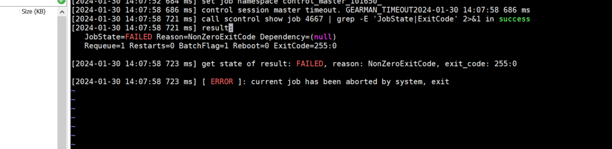

#bug 
# 情形
1. 使用 [Job Manager](Job%20Manager.md) 创建的路径提交都会失败，使用一个新的路径 copy recipe 可以正常跑通
2. backup 文件夹有 script 但是是空的。
3. recipe 文件权限
	1. 改成 777可以正常执行
	2. 555 的话执行失败
# 解决步骤
1. [session_controller](session_controller.md)/log/control_prober.log  中是否含有这部分信息  

